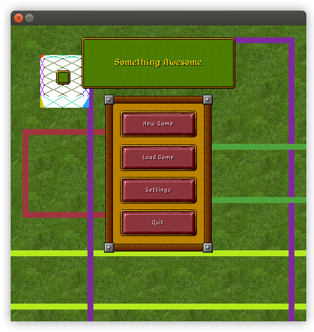

# Pipera

**Pixel Perfect GUI library written on top of SDL.**

This is one of my sideprojects to test my knowledge and excercise. The library itself is rather a fun experiment than a library targeted at real-life use, since it is purely software rendered and is not really optimized. (although I try my best at the latter)

***It is very, very, VERY work in progress.***

I really like good UIs and good UX design and I was thinking a lot about the implementation of a generic UI toolkit (like GTK). Then it became my own challenge.

## Features

*(not all of these are implemented yet)*

- pixel based, perfect for pixel art UIs
- powerful window aligning sytem
- transparency support via color keying
- easily extendable system to create your very own looking and functioning widgets
- powerful and easy to understand ([SRP](https://en.wikipedia.org/wiki/Single_responsibility_principle)) containers to create every layout and decoration you can imagine
- free!

## What is done?

Not much, likely, because I would have updated this section otherwise. Look at the code and find out. Happy experimenting!

## License

MIT.